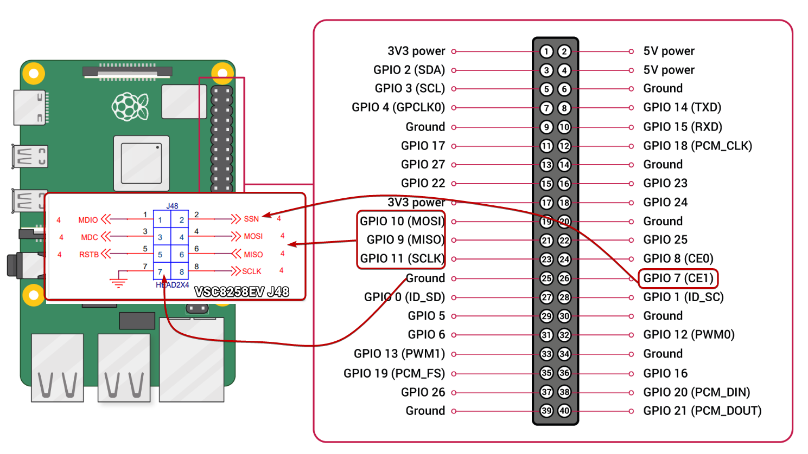

<a href="https://www.microchip.com" rel="nofollow"></a>

# MEPA Sample Code for VSC8258EV


## Description:
This is a simple project that shows how to use MEPA to bring-up the PHY on a VSC8258EV.


## Hardware Setup:
The project was tested on the following boards:

- VSC8258EV
- Raspberry Pi 5

For the setup, please refer to **Step 4** in the following KB Article: <br>
https://microchipsupport.force.com/s/article/VSC8258EV---Run-the-phy-demo-appl-Example-on-a-Raspberry-Pi

Hardware connections are shown below (applies to both Raspberry Pi 4B and Raspberry Pi 5. May also work on Raspberry Pi CM4):


## Software Used:
The project has been tested with <span style="color: red;">**SW-MEPA v2025.06**.</span>

SW-MEPA can be downloaded from GitHub in the link below:<br>
https://github.com/microchip-ung/sw-mepa

## Build and Run the Code:
To build and run the project on a Raspberry Pi running Pi OS, please refer to the steps below. These were tested on the following:
- Raspberry Pi CM4 running Pi OS Trixie (Debian 13)
- Raspberry Pi 5 running Pi OS Bookworm (Debian 12)

### Steps
1. Ensure `spidev` is enabled through `sudo raspi-config` -> `Interface Options` -> `SPI`. You may need to reboot your RPi afterwards. <br>
To double-check, use `ls /dev | grep spi`
2. Install the dependencies for SW-MEPA.
```
$ sudo apt-get install cmake cmake-curses-gui build-essential ruby ruby-parslet libjson-c-dev -y
```
3. Clone v2025.06 of SW-MEPA and v2024.12 of MESA (which this version of SW-MEPA was tested on...)
```
$ git clone https://github.com/microchip-ung/sw-mepa --branch=v2025.06 --depth=1 mepa_v2025.06
$ cd mepa_v2025.06

// Check MESA version dependency using:
$ cat .cmake/deps-mesa.json

// Clone MESA 2024.12
$ git clone https://github.com/microchip-ung/mesa --branch=v2024.12 --depth=1 sw-mesa
$ cd ../
```

4. Create a folder where this project will reside, and copy the source code into it. <br>(**NOTE**: you might need to download/clone this repo into your PC first, before copying it manually to your RPi (if your RPi is not connected to the Internet). Otherwise, just 'git clone' the repo directly.)
```
$ mkdir mepa-malibu10-rpi
// Copy source code into mepa-malibu10-rpi/

$ ls
mepa-malibu10-rpi  mepa_v2025.06
```

5. `cd` into the `mepa-malibu10-rpi` folder and run the following `CMake` command. Then, run make to build the libraries.
```
$ cd mepa-malibu10-rpi
$ cmake ../mepa_v2025.06 -DMEPA_vtss=ON -DMEPA_vtss_opt_10g=ON -DBUILD_MEPA_DEMO=OFF -DMEPA_vtss_opt_1g=ON
$ make -j${nproc}
```

6. Double-check to ensure the libraries have been built:
```
$ find . -name "*.a"
./mepa/vtss/libmepa_drv_vtss_custom.a
./mepa/libmepa_common.a
./mepa/libmepa.a
...
```

7. Run the shell script ``build_app.sh``
```
$ chmod +x build_app.sh
$ ./build_app.sh
```

8. Run the custom application:
```
$ ./malibu_custom
```

### Additional Information
For more information on how to build other projects, you may opt to follow the KB Article below: <br>
https://microchipsupport.force.com/s/article/First-Steps-in-Creating-a-MEPA-Application

## History:


| Date        | Description     | Modified By:            |
| ----------- | --------------- | ----------------------- |
| 02-Oct-2024 | Initial release | mjneri |
| 13-Jan-2026 | Update code after <br> testing with SW-MEPA 2025.06 |mjneri|

