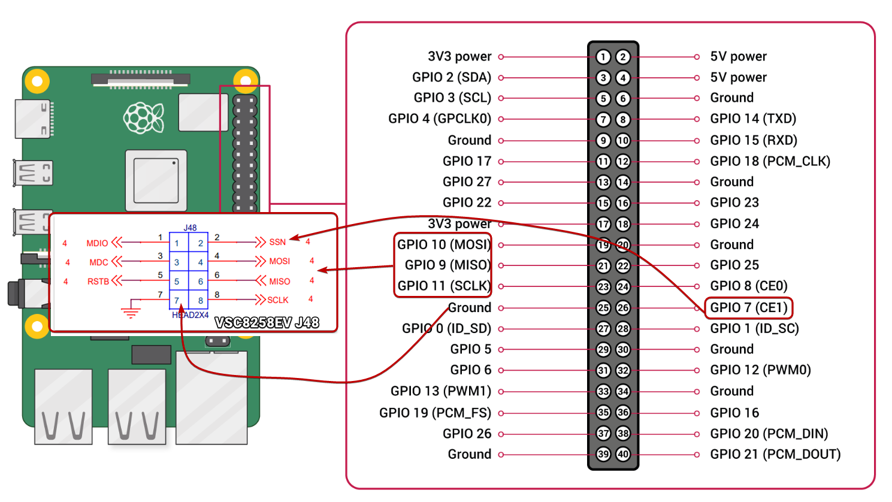

<a href="https://www.microchip.com" rel="nofollow"></a>

# MEPA Sample Code for VSC8258EV


## Description:
This is a simple project that shows how to use MEPA to bring-up the PHY on a VSC8258EV.

## ⚠️ Disclaimer
This project is provided for testing and evaluation of the VSC8258EV and may also be used as a reference when developing your own MEPA application. It is **not** production-ready code and is provided for reference purposes only.


## Hardware Setup:
The project was tested on the following boards:

- VSC8258EV
- Raspberry Pi 5

For the setup, please refer to **Step 4** in the following KB Article: <br>
https://microchipsupport.force.com/s/article/VSC8258EV---Run-the-phy-demo-appl-Example-on-a-Raspberry-Pi

Hardware connections are shown below (applies to both Raspberry Pi 4B and Raspberry Pi 5. May also work on Raspberry Pi CM4):


## Software Used:
The project has been tested with <span style="color: red;">**SW-MEPA v2025.12**.</span>

SW-MEPA can be downloaded from GitHub in the link below:<br>
https://github.com/microchip-ung/sw-mepa

## Build and Run the Code:
To build and run the project on a Raspberry Pi running Pi OS, please refer to the steps below. These were tested on the following:
- Raspberry Pi CM4 running Pi OS Trixie (Debian 13)
- Raspberry Pi 5 running Pi OS Bookworm (Debian 12)

### Steps
1. Ensure `spidev` is enabled through `sudo raspi-config` -> `Interface Options` -> `SPI`. You may need to reboot your RPi afterwards. <br>
To double-check, use `ls /dev | grep spi`
2. Install the dependencies for SW-MEPA.
```
$ sudo apt-get install cmake cmake-curses-gui build-essential ruby ruby-parslet libjson-c-dev -y
```
3. Clone v2025.12 of SW-MEPA and v2025.09 of MESA (which this version of SW-MEPA was tested on...)
```
$ git clone https://github.com/microchip-ung/sw-mepa --branch=v2025.12 --depth=1 mepa_v2025.12
$ cd mepa_v2025.12

// Check MESA version dependency using:
$ cat .cmake/deps-mesa.json

// Clone MESA 2025.09
$ git clone https://github.com/microchip-ung/mesa --branch=v2025.09 --depth=1 sw-mesa
$ cd ../
```

4. Create a folder where this project will reside, and copy the source code into it. <br>(**NOTE**: you might need to download/clone this repo into your PC first, before copying it manually to your RPi (if your RPi is not connected to the Internet). Otherwise, just 'git clone' the repo directly.)
```
$ mkdir mepa-app-malibu10-rpi
// Copy source code into mepa-app-malibu10-rpi/

$ ls
mepa-app-malibu10-rpi  mepa_v2025.12
```

5. `cd` into the `mepa-app-malibu10-rpi` folder and run the following `CMake` command. Then, run make to build the libraries.
```
$ cd mepa-app-malibu10-rpi
$ cmake --fresh ../mepa_v2025.12 -DMEPA_vtss=ON -DMEPA_vtss_opt_10g=ON -DBUILD_MEPA_DEMO=OFF -DMEPA_vtss_opt_1g=ON -DMEPA_vtss_opt_ts=ON -DCMAKE_C_FLAGS="${CMAKE_C_FLAGS} -DLMU_PP_USE___VA_OPT__=1"
$ make -j${nproc}
```
Note: There were changes in MESA v2025.06 onwards that could result in some build errors related to the GCC version used. Adding the last C Flag above helps get around these errors.

6. Double-check to ensure the libraries have been built:
```
$ find . -name "*.a"
./mepa/vtss/libmepa_drv_vtss_custom.a
./mepa/libmepa_common.a
./mepa/libmepa.a
...
```

7. Run the shell script ``build_app.sh``
```
$ chmod +x build_app.sh
$ ./build_app.sh
```

8. Run the custom application:
```
$ ./malibu_custom
```
You should be prompted with similar logs as below. The application will perform an SPI IO test before prompting the user to select the PHY Operating Mode.
This IO test can help confirm if the HW connections between the Raspberry Pi and VSC8258EV are working.
```
Raspberry Pi 5 Malibu Code.
main (ERROR): Error at 1390
// Default Setup Assumptions:
// Board has Power Applied prior to Demo start
// PHY was reset through RESETN prior to Demo start
// Pwr Supply/Voltages Stable, Ref Clk Stable, Ref & PLL Stable

main: Connecting to the Malibu board via SPI...
main: Initializing RPI SPI...
In Line 1412: Dev ID = 0x8258

========================================================================
Running SPI IO Test

Read Global Device_ID register (0x1E:0x0000)...
[Port 0] 0x1E:0x0000 = 0x8258
[Port 1] 0x1E:0x0000 = 0x8258
[Port 2] 0x1E:0x0000 = 0x8258
[Port 3] 0x1E:0x0000 = 0x8258


Test Writes to LINE_PMA_32BIT Register SD10G65_OB_CFG2 (0x01:0xF112)...
=== Port 0 ===
[Port 0] Read value: 0x1:0xF112 = 0x7DF820 ; Writing 0x3DF828...
[Port 0] New value:  0x1:0xF112 = 0x3DF828 ; Write back 0x7DF820...
[Port 0] New value:  0x1:0xF112 = 0x7DF820

=== Port 1 ===
[Port 1] Read value: 0x1:0xF112 = 0x7DF820 ; Writing 0x4DF828...
...
=== Port 3 ===
[Port 3] Read value: 0x1:0xF121 = 0x88888924 | Writing 0x48888924...
[Port 3] New value:  0x1:0xF121 = 0x48888924 | Write back 0x88888924...
[Port 3] New value:  0x1:0xF121 = 0x88888924


SPI IO Test Done.
========================================================================

Configuring Operating MODE for PHY Ports:
   0 = MODE_10G_LAN
   1 = MODE_1G_LAN_CL37
   2 = MODE_1G_LAN
   3 = MODE_10G_WAN
   4 = MODE_10G_RPTR
   5 = MODE_1G_RPTR
Enter Oper_MODE (0/1/2/3/4/5):
```
Once you select the desired operating mode, you should see the following menu at the end of the initialization process, which will show the currently supported commands in the application.
```
 *************************************
 The following commands are supported:
 dump <port_no> - Dump detailed PHY, PHY_TS, MACsec, or ALL register groups for Port
 ----------------------------------------  |  -------------------------------------------------------
 spird    <port_no> <dev> <addr>           |  spiwr       <port_no> <dev> <addr> <value> - Value MUST be in hex
 ----------------------------------------  |  -------------------------------------------------------
 10g_kr   <port_no> - 10G Base KR          |  synce       <port_no> - Sync-E Config
 status   <port_no> - Rtn PHY Link status  |  vscope      <port_no> - Config for VSCOPE FAST/FULL SCAN
 lpback   <port_no> - Set PHY Loopback     |  oper_mode   <port_no> - Re-configure Port for the desired configuration.
 dbgdump  <port_no> - Simple PHY Reg Dump  |
 ----------------------------------------  |  -------------------------------------------------------
 sfpdump   <port_no> <i2c_addr> - SFP Dump |  sfp_status  <port_no> - Basic SFP Status Info
 sfp_txdis <port_no> - Disable TX on SFP   |  sfp_txen    <port_no>   - Enable TX on SFP

 exit - Exit Program

>
```
Note that commands may be added in the future based on future releases of the API.

### Additional Information
For more information on how to build other projects, you may opt to follow the KB Article below: <br>
https://support.microchip.com/s/article/First-Steps-in-Creating-a-MEPA-Application

#### Changing the Trace Level
MEPA can display logs based on the trace level. For this project, the trace level is defined at compile time, and may be changed by modifying the 'MACROS' variable in `build_app.sh`:
```
# Trace Levels:
#   -DAPPL_TRACE_LVL_RACKET 
#   -DAPPL_TRACE_LVL_NOISE  
#   -DAPPL_TRACE_LVL_DEBUG  
#   -DAPPL_TRACE_LVL_INFO   
#   -DAPPL_TRACE_LVL_WARNING
#   -DAPPL_TRACE_LVL_ERROR  
#   -DAPPL_TRACE_LVL_NONE
...
MACROS="-DAPPL_TRACE_LVL_ERROR"
```
Once the trace level is modified, simply re-run `build_app.sh` to rebuild the application. Once you re-run `malibu_custom`, you should see some test traces that should match the selected trace level in the script.

For example, if you set the trace level to APPL_TRACE_LVL_DEBUG, then you should see the following at the start of the application:
```
$ ./malibu_custom
Raspberry Pi 5 Malibu Code.
main (ERROR): Error at 1390
main (DEBUG): Debug at 1391
main (WARNING): Warning at 1392
main (INFO): Info at 1393
// Default Setup Assumptions:
// Board has Power Applied prior to Demo start
// PHY was reset through RESETN prior to Demo start
// Pwr Supply/Voltages Stable, Ref Clk Stable, Ref & PLL Stable
...
```


#### Standalone SPI IO Test
If you would prefer to simply run an IO test to confirm the SPI communication between your Raspberry Pi and VSC8258EV, there is also a `malibu_io_test` application, which can be build by running the `build_io_test.sh` script.

Running the `malibu_io_test` application should show the same prompt as above, when you run the `malibu_custom` application.

Since `malibu_io_test` has its own shell script, you can also change the trace level inside `build_io_test.sh`, similar to the previous section.

## History:


| Date        | Description     | Modified By:            |
| ----------- | --------------- | ----------------------- |
| 02-Oct-2024 | Initial release | mjneri |
| 13-Jan-2026 | Update code after <br> testing with SW-MEPA 2025.06 |mjneri|
| 02-Mar-2026 | Update code/README to build with <br> SW-MEPA 2025.12 |mjneri|
| 06-Mar-2026 | Overhaul of the demo application, <br> tested with SW-MEPA 2025.12 |mjneri|

